# milieu 

[](https://github.com/citizenhicks/milieu/actions/workflows/ci.yml)
[](https://github.com/citizenhicks/milieu/releases)
[](https://github.com/citizenhicks/homebrew-milieu)

Milieu is a small CLI that syncs encrypted dotenv files across machines without committing plaintext secrets.

**Beta warning:** this project is in public beta. Use at your own risk.

## Features

- End-to-end encrypted dotenv sync (.env and .env.\* only)
- Git-like workflows (status, push, pull, changes, history, checkout)
- Branch-scoped env sets per repo
- Recovery phrase + keychain-backed UMK storage
- Team access controls (read/write roles, invites)
- Session management + device tracking
- Self-hostable Cloudflare Worker + D1 API
- Shared repo keys for collaborators (owner runs `milieu repos manage share --repo <name>`)

This repo contains:

- `crates/milieu`: the Rust CLI
- `server`: a minimal HTTP API (Cloudflare Workers + D1) that stores only ciphertext

## Status

Default API base URL: `https://milieu.sh` (override with `MILIEU_BASE_URL`).

## Install

Homebrew tap (macOS + Linux):

```
brew tap citizenhicks/milieu
brew install milieu
```

## Collaboration & repo keys

Milieu now uses a per-repo shared key for encryption. The owner must share the repo key with collaborators:

```
milieu repos manage share --repo <name>
```

## Encryption flow

```mermaid
sequenceDiagram
  autonumber
  participant U as User
  participant C as Milieu CLI
  participant K as Keychain
  participant S as API
  participant D as D1

  rect rgba(203, 166, 247, 0.08)
  note over U,C: User onboarding
  U->>C: login / init / clone
  C->>C: derive UMK from recovery phrase
  C->>C: derive user keypair from UMK (X25519)
  C->>S: PUT /v1/users/me/key (public key)
  S->>D: store user_keys
  end

  rect rgba(166, 227, 161, 0.08)
  note over U,C: Repo bootstrap
  U->>C: init repo
  C->>C: generate repo key (32 bytes)
  C->>C: wrap repo key for owner (X25519 + HKDF)
  C->>S: PUT /v1/repos/:id/key (wrapped_key)
  S->>D: store repo_keys (per user)
  C->>K: store repo key locally
  end

  rect rgba(249, 226, 175, 0.08)
  note over U,C: Collaboration
  U->>C: invite collaborator
  C->>S: POST /v1/repos/:id/access
  S->>D: create invite
  U->>C: share repo key
  C->>S: GET /v1/repos/:id/access (public keys)
  C->>C: wrap repo key for each collaborator
  C->>S: PUT /v1/repos/:id/key (wrapped_key, email)
  S->>D: store repo_keys
  end

  rect rgba(137, 180, 250, 0.08)
  note over U,C: Write path
  U->>C: push .env
  C->>C: aad = v2|repo|branch|path|tag
  C->>C: encrypt file with repo key (XChaCha20‑Poly1305)
  C->>S: POST /v1/repos/:id/branches/:b/objects
  S->>D: store ciphertext only
  end

  rect rgba(180, 190, 254, 0.08)
  note over U,C: Read path
  U->>C: pull .env
  C->>S: GET /v1/repos/:id/key (wrapped_key)
  C->>C: unwrap with private key (X25519 + HKDF)
  C->>C: decrypt file with repo key
  end
```



## Recovery phrase collision risk

Milieu generates a 12-word BIP39 recovery phrase from 128 bits of entropy. That means the chance of two users ever generating the same phrase is about 1 in 2^128 (~3.4e38). In practice, collisions are astronomically unlikely and are not a realistic risk compared to account compromise or device loss.

## Server config (local)

Use `server/wrangler.local.toml` for your local route + D1 settings. The repo includes
`server/wrangler.local.toml.example` as a template.

## Release to Homebrew Tap (macOS + Linux)

Automated on tag push (see `.github/workflows/release-brew.yml`):

## Quick layout

```
crates/milieu/   # Rust CLI
server/         # Cloudflare Workers API + D1 schema
```
